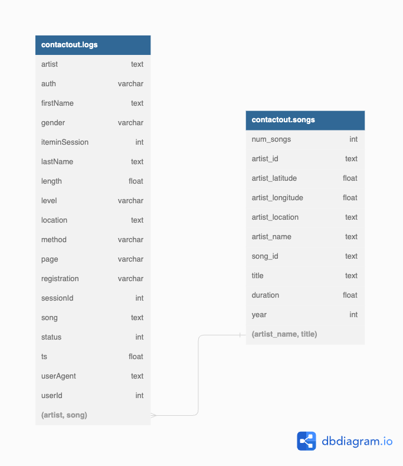

# ContactOut data-engineering challenge

## Part-1 ETL
* **Look at the [logs](./data/log_data) and [song_data](./data/song_data) and design a schema for the database.**
    * [Schema Diagram can be viewed here](https://dbdiagram.io/d/63568eb3fa2755667d5d8c58)
    * Following conventions for db and tables are used: 
        * Database : contactout
            * Tables : logs, song

        * 

        * Table : logs(contactout.logs)
            * artist    text
            * auth  varchar
            * firstName text
            * gender varchar
            * iteminSession int
            * lastName text
            * length float
            * level varchar
            * location text
            * method varchar
            * page varchar
            * registration varchar
            * sessionId int
            * song text
            * status int
            * ts float
            * userAgent text
            * userId int

        * Table : songs(contactout.songs)
            * num_songs int
            * artist_id text
            * artist_latitude float
            * artist_longitude float
            * artist_location text
            * artist_name text
            * song_id text
            * title text
            * duration float
            * year int
            
        
        * Relationships
            * contactout.logs(artist, song) has many to one relationship with contactout.songs(artist_name, title)

    * Reasoning and Explanations
        * Why is there no primary key and foreign key relationship between the tables?
            * contactout.logs and contactout.songs has following overlapping keys:

            * | contactout.logs | contactout.songs |
                |----|-----|
                |artist|artist_name|
                |legnth|duration|
                |song|title|
            
            * artist_name,title together can identify rows uniqely in contactout.songs(an artist can have multiple songs, multiple artists can have same song name, so only the pair (artist_name,title) happens to be unique)
            * However (artist,song) cannot uniquely identify a row because user can listen to single song multiple times.
            * That's why contactout.logs has many to one relationship with contactout.songs
            * Foreign key relationship is not possible because we will have songs table(parent table with (artist_name, title) as PRIMARY KEY) but there are some pair of (artist, song) in logs table which are not present in songs table and hence the validity constraint of Foreign key doesn't stand.

* **Load the data into the database.** 
    * Please refer to the [jupyter notebook](eda.ipynb)

* **Answer the questions:**
    * Please refer to the same [jupyter notebook](eda.ipynb)

* **Explanation Recording:**

## Part-2 SQL
* **Explanation Recording**

